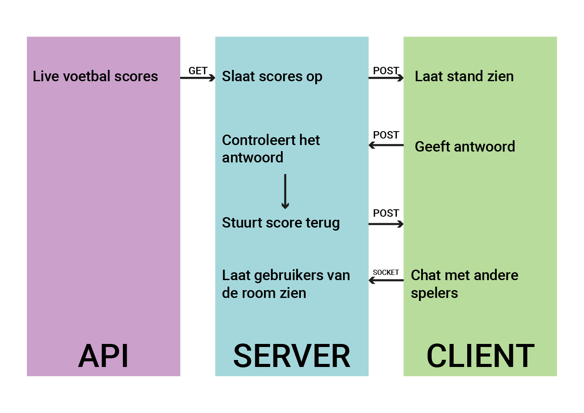

# Real-Time Web @cmda-minor-web · 2019-2020

**Week 1 code zie [branch week-1](https://github.com/martendebruijn/real-time-web-1920/tree/week-1)**

## 👾 Introductie

Stukje introductie tekst over de course etc.

## ✏️ Concept

Mijn concept is een spel die gebruik maakt van real time voetbal wedstrijd standen. Gebruikers kunnen tegen elkaar spelen. Ze kunnen aanklikken welk team het eerstvolgende doelpunt gaat maken. Als de gebruiker het goed heeft verdiend hij of zij een punt. Hiermee kan men live interactief gokken op wedstrijden.
\
Omdat de meeste competities momenteel stil liggen vanwege Covid-19, focus ik mij op de competities van landen als Belarus, die nog wel spelen.

- [ ] Concept tekst beter omschrijven
- [ ] Wireframes maken

<!-- Zie de [wiki](https://github.com/martendebruijn/real-time-web-1920/wiki) voor een uitgebreidere uitleg. -->

## 🕹 Live Demo

[Bekijk hier een live demo 😃](#)

## 👨‍🦯 Usage

```
git clone https://github.com/martendebruijn/real-time-web-1920.git
cd /real-time-web-1920/
npm install
npm start
```

## 📍 Table of Contents

- [⚠️ Known Issues](#%EF%B8%8F-known-issues)
  - [API can't find city](#api-can't-find-city)
- [🐒API](#-Api)
- [🛠 Tools Used](#-Tools-used)
- [📈 Data Life Cycle Diagram](#-data-life-cycle-diagram)
- [⚙️ NPM Scripts](#%EF%B8%8F-npm-scripts)
- [🧦 Socket IO Events](#🧦-Socket-IO-Events)
- [❌ Errors](#❌-Errors)
  - [API can't find a city](#API-can't-find-a-city)
  - [Other](#Other)
- [✨ Whishlist](#-Whishlist)
- [🙌 Credits](#-Credits)
  - [Dataset Used](#Dataset-Used)
- [📚 Sources](#-Sources)
- [✅ Todo list](#-Todo-list)

## ⚠️ Known Issues

- Leaderboard wordt bij de 1e vraag niet geupdate
- Chat messages worden niet meer weergegeven
- `TypeError: Cannot read property 'temp' of undefined` -> api.js:12 -> index.js:88

### API can't find city

> ❗️ This isn't updated anymore. When the API can't find a city, it will be automaticly added to `api-city-bugs.txt`.

- Nursultan

## 🐒 API

- [ ] API omschrijving toevoegen
      [wheater api](https://openweathermap.org/current)

## 🛠 Tools used

- nodejs
- nodemon
- ejs
- expressjs
- dotenv
- heroku
- node file system
- socket io 2.0

## 📈 Data Life Cycle Diagram



## ⚙️ NPM Scripts

- dev

## 🧦 Socket IO Events

- Connection
- Aantal spelers
- Change username
- Game start
- Chat message
- Give answer
- Send temp
- Update leaderboard
- Next question
- Final leaderboard
- Disconnect

## ❌ Errors

### API can't find a city

- `Error: in getWeather() in api.js kon de api ${city} niet vinden.`
- This city will automaticly be added to `api-city-bugs.txt`

### Other

- console.log('Error: checkHighestTemp() in index.js gave no output.');
- 'Error: in checkAnswers() in index.js, amount of answers received is not equal to the amount of players playing.'
- 'Error: in writeNewScores() in index.js length of addAmount is not equal to the amount of players or question index is not under 9.'

## ✨ Whishlist

- Voeg toe dat de laatst opgehaalde temperatuur bij de dataset wordt toegevoegd voor als de app over het request limiet van de api heen is.
- Ervoor zorgen dat wanneer de api een stad niet kan vinden, de stad automatisch wordt toegevoegd aan een bugs file.
- Ervoor zorgen dat als een stad niet gevonden wordt, er een api call wordt gedaan met het land i.p.v. de stad.
- Ervoor zorgen dat als een land niet gevonden kan worden (verkeerd gespeld/too many request) een andere stad ervoor in de plaats komt.

## 🙌 Credits

- [Meyerweb: CSS Reset](http://meyerweb.com/eric/tools/css/reset/)
- [Tobiashlin: Document ready from jquery to vanilla JS](https://tobiasahlin.com/blog/move-from-jquery-to-vanilla-javascript/#document-ready)

### Dataset Used

[Country-capital dataset made by Samayo](https://data.world/samayo/country-capital-city) \

**Changes made:**

- Removed the countries that don't have capitals.
- Added continents.
- Changed the capital city name of Austria from the native name to the English name -> `Wien` -> `Vienna`.
- Changed the capital city of Bolivia from `La Plata` to `Sucre` since [it isn't known as La Plata anymore](https://en.wikipedia.org/wiki/Sucre).
- Changed the capital city of Brazil to `Brasília`.
- Changed the capital city of Burundi from `Bujumbra` to `Gitega` since [it is Gitega as of March 2007](https://simple.wikipedia.org/wiki/Gitega).
- Changed the capital city of China from `Peking` to `Beijing` since the city changed it name to Beijing.
- Changed the capital city of Colombia from `Santaf` to `Bogotá`.
- Added `é` to capitals that have it in their name, because they weren't there.
- Changed the capital city of Kazakhstan from `Astana` to `Nur-Sultan` since [it's renamed in 2019](https://simple.wikipedia.org/wiki/Nur-Sultan).
- Changed the capital city of Myanmar from `Rangoon` to `Naypyidaw` since it's [the new capital of Myanmar](https://simple.wikipedia.org/wiki/Naypyidaw).
- Removed `Yugoslavia` since it is [a former country](https://en.wikipedia.org/wiki/Yugoslavia).
- Added images of the countries flag.
- Need to add a display name and a search name as the api don't seems to find cities with `é` `á` etc...

## 📚 Sources

📖 Artikel / Documentation | ⚙️ Code | 📹 Video | 🛠 Tools

- 📖 [Socket IO - Getting Started](https://socket.io/get-started/chat/)
- 📖 [Build a Simple Chat App With NodeJS and SocketIO - Medium - Noufel Gouirhate](https://medium.com/@noufel.gouirhate/build-a-simple-chat-app-with-node-js-and-socket-io-ea716c093088)
- 📖 [List of Countries by Continents](https://simple.wikipedia.org/wiki/List_of_countries_by_continents)
- 📖 [EJS Documentation](https://ejs.co/#docs)
- 📖 [Loading images that not exist - Medium - Rahul Nanwani](https://blog.imagekit.io/how-to-handle-loading-images-that-may-not-exist-on-your-website-92e6c3c6ea63)

## ✅ To do list

- [ ] Real Time Web
  - [ ] Chat functie
    - [x] ~~Basis~~
    - [ ] Als er overflow is → automatisch naar het laatste bericht scrollen (/focus)
  - [ ] Server berichten
  - [ ] Rooms
    - [ ] Geneer uniek game-ID
  - [x] ~~Questions genereren~~
  - [x] ~~Antwoorden controleren~~
  - [x] ~~Score systeem~~
  - [ ] Leaderboard updaten
    - [x] ~~Scores updaten~~
    - [ ] UserID's niet mee sturen naar de client -> veranderen naar usernames !!!
    - [ ] Nicknames weergeven in leaderboard
    - [ ] Toevoeging geven als er dezelfde nicknames zijn
  - [ ] Beginscherm
    - [ ] Laat zien (usernames) wie allemaal in de lobby zitten
    - [ ] Voeg welkomsmessage toe als men zijn username invoert
  - [ ] Game
    - [x] Nieuwe vraag renderen
    - [ ] Add country
    - [ ] Add current time (of city)
    - [ ] Add possibility to filter on continent
    - [ ] Add final scores
    - [ ] Add 'Next round in ...' timer
    - [ ] Zorg ervoor dat er niet meer geklikt kan worden als de antwoorden worden gegeven
  - [x] ~~Code opschonen~~
    - [x] ~~Code meer splitsen in functies~~
    - [x] ~~Code meer splitsen in modules~~
  - [ ] Styling
    - [ ] Leaderboard styling toevoegen
    - [ ] Countdown animatie toevoegen
    - [ ] Feedback correcte antwoord geven
    - [ ] Responsive maken
    - [ ] Make placeholder for when the image can't be find
  - [ ] Performance
    - [ ] Add Gulp
      - [ ] Add minifying
        - [ ] CSS
        - [ ] ES
  - [ ] README
    - [ ] Concept aanpassen
    - [ ] Data Life Cycle diagram aanpassen
    - [ ] Api sectie aanpassen
    - [ ] Custom events toevoegen

❤️ Thanks for reading ❤️<br/>
❤️ Marten de Bruijn ❤️
